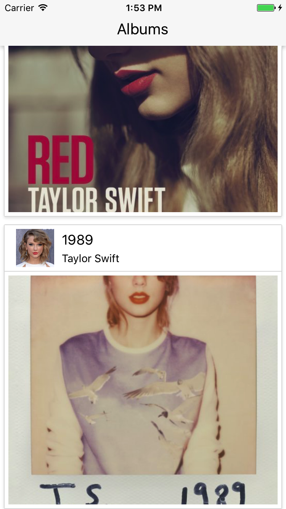
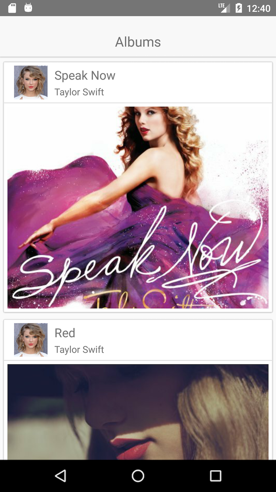

# Simple React Native Application - iOS and Android

[Install dependencies and configure environment for iOS and Android](https://facebook.github.io/react-native/docs/getting-started.html)

Run the app:
- iOS: `react-native run-ios`
- Android: `react-native run-android`
  
iOS             |  Android
:-------------------------:|:-------------------------:
  |   
